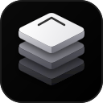
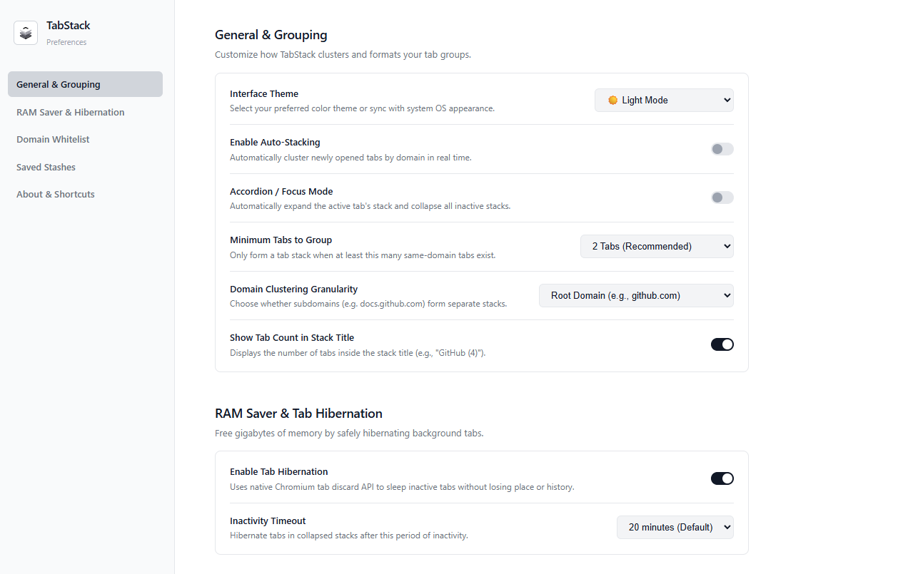
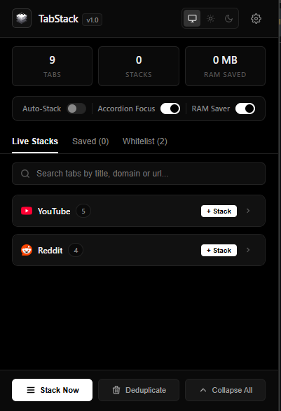
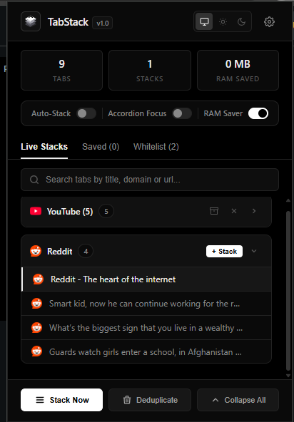
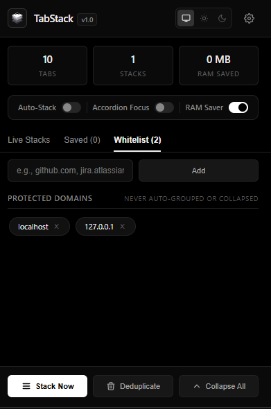
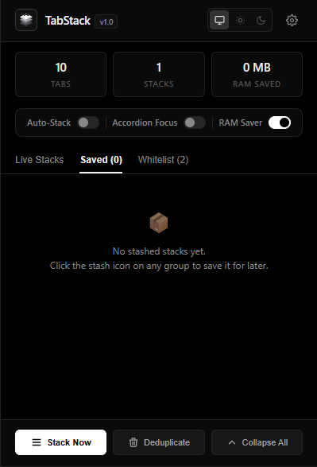
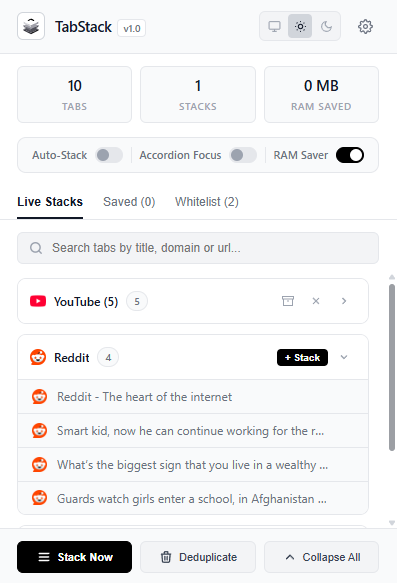

# TabStack 🗂️⚡

<p align="center">
  
</p>

<p align="center">
  <strong>Smart Tab Auto-Collapse & RAM Saver for Chromium Browsers</strong><br />
  Automatically clusters same-site tabs into native collapsible groups, expands only your active stack (Accordion Mode), and frees system memory.
</p>

<p align="center">
  <a href="https://yarooqh.github.io/tabstack/"></a>
  
  
  
  
</p>

---

## 🌟 Overview

Tired of having 50+ squished, microscopic tabs that crash your browser's performance and make tab-hunting impossible?

**TabStack** transforms tab chaos into clean, color-coded, collapsible domain stacks using native Chromium tab groups. When you switch tasks, **Accordion Mode** automatically expands the domain you are actively working in while collapsing dormant groups, keeping your horizontal tab strip readable and clutter-free.

<p align="center">
  
</p>

---

## ✨ Key Features

### 1. ⚡ 1-Click Automatic Domain Stacking
Clusters same-site tabs (YouTube, GitHub, Figma, Linear, Reddit, Docs) into tidy, color-coded native tab groups with a single click or keyboard shortcut.

<p align="center">
  
  &nbsp;
  
</p>

### 2. 🎯 Accordion Focus Mode (Single-Stack Workflow)
Automatically unfolds the tab group you are currently browsing while keeping inactive stacks neatly folded at compact width. Switching tasks automatically closes the previous stack so your tab bar never overflows.

<p align="center">
  
</p>

### 3. 💤 Smart RAM Saver (Native Tab Hibernation)
Suspends idle background tabs using Chromium's native `chrome.tabs.discard()` API. Free up hundreds of megabytes of RAM without closing your tabs or losing scroll positions and form state.

<p align="center">
  
</p>

### 4. ⚙️ Granular Controls & Domain Whitelisting
Configure custom hibernation timeouts, root vs. subdomain grouping, minimum tab thresholds, and domain whitelists (e.g., `meet.google.com`, `localhost`, `figma.com`) to prevent active tools from ever being grouped or put to sleep.

<p align="center">
  
</p>

---

## ⌨️ Default Keyboard Shortcuts

| Shortcut | Action |
| :--- | :--- |
| <kbd>Alt</kbd> + <kbd>Shift</kbd> + <kbd>T</kbd> | Open TabStack Popup Dashboard |
| <kbd>Alt</kbd> + <kbd>Shift</kbd> + <kbd>S</kbd> | Group & Stack all tabs in current window |
| <kbd>Alt</kbd> + <kbd>Shift</kbd> + <kbd>A</kbd> | Toggle Accordion Focus Mode on/off |

*(Customizable anytime via `chrome://extensions/shortcuts`)*

---

## 🔒 Privacy & Performance Guarantee

* **Zero Injected Content Scripts:** TabStack never touches or inspects webpage DOM contents.
* **100% Local Execution:** No remote analytics, tracking pixels, or data collection. Your open tabs and browsing history never leave your machine.
* **Lightweight Service Worker:** Event-driven architecture with debounced operations (150ms) to ensure 0% CPU overhead.

---

## 🚀 Installation & Local Development

### Load Unpacked Extension
1. Clone this repository:
   ```bash
   git clone https://github.com/YarooqH/tabstack.git
   ```
2. Open your Chromium browser (Chrome, Brave, Edge, Arc) and go to `chrome://extensions/`.
3. Enable **Developer mode** in the top-right corner.
4. Click **Load unpacked** and select the root `tabstack/` folder.

### Running the Landing Page Locally
```bash
cd landing
npm install
npm run dev
```
Open `http://localhost:5173` to explore the interactive simulator.

---

## 🌐 Live Landing Page
Visit the live interactive landing page at:
👉 **[https://yarooqh.github.io/tabstack/](https://yarooqh.github.io/tabstack/)**

---

## 📄 License
MIT License. Free and open source.
